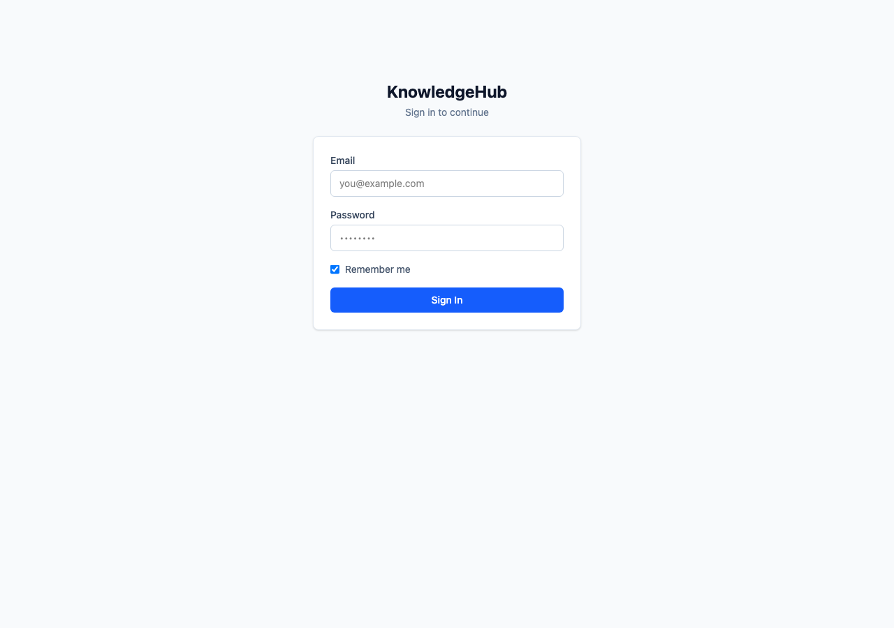
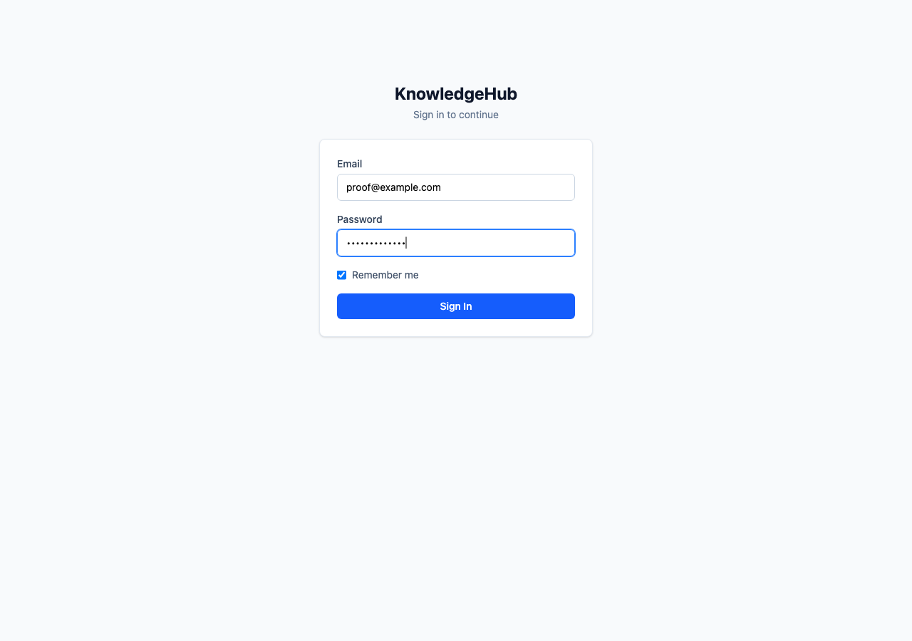
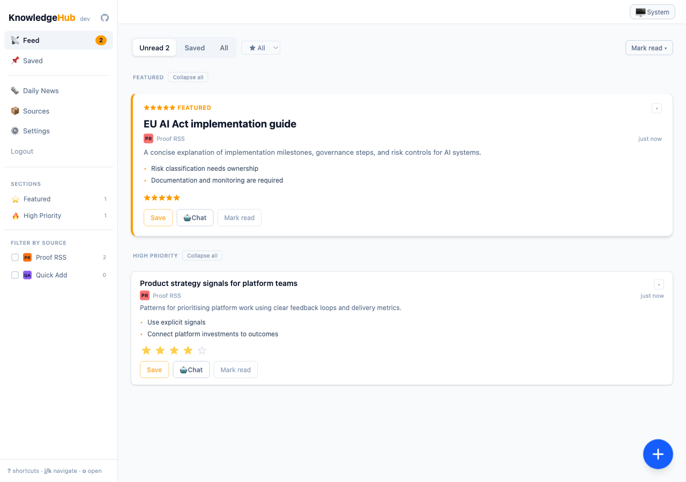
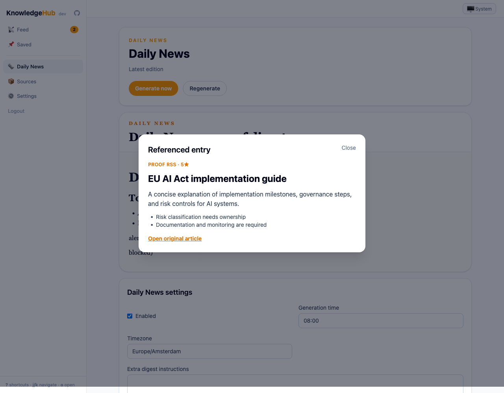
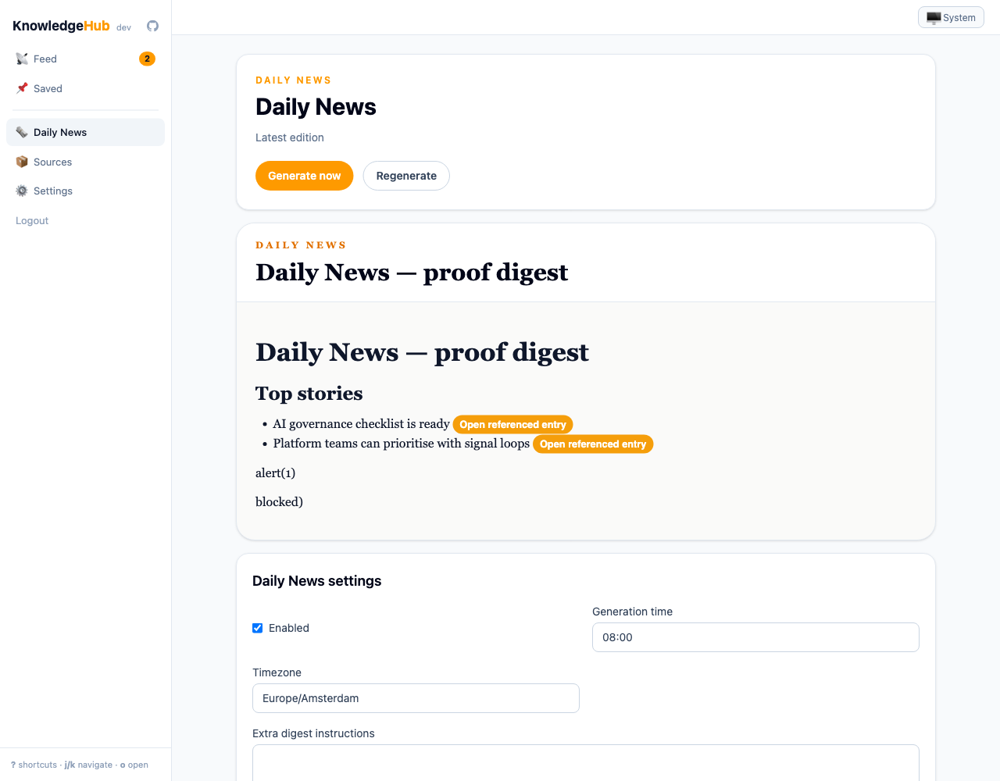

# CAD-xxxx — Daily News Digest proof

Proof captured from worktree `daily-news-digest` on 2026-05-09 against a local PocketBase/Svelte app at `http://127.0.0.1:18090`.

## What is proven

- Authenticated users see the new **Daily News** navigation item.
- The Daily News page renders a latest digest with newspaper styling.
- Digest Markdown entry markers render as internal **Open referenced entry** controls.
- The digest sanitizer does not execute raw HTML or `javascript:` links; the malicious sample appears as inert text.
- Referenced entries open through the digest-scoped entry modal.
- Daily News settings are readable and saveable through the explicit API route.
- Manual generation is accepted asynchronously as a persisted pending job.

## UI proof

### 1. Sign-in screen

### 2. Credentials filled before sign in

### 3. Feed after sign in, including Daily News navigation

### 4. Daily News latest digest

Shows the latest digest, controls, sanitized body, internal reference controls, settings, and previous editions.

### 5. Digest-scoped entry reference modal

Clicking an internal `[[kh-entry:<id>]]` reference opens the referenced entry card modal with source, stars, summary, takeaways, and original-article link.

### 6. Settings area before/while editing

### 7. Settings saved confirmation

## API proof

Recorded requests and responses are in [`api-proof.md`](api-proof.md). Highlights:

- `GET /api/daily-news/settings` returns materialized per-user defaults.
- `PUT /api/daily-news/settings` persists generation time, timezone, enabled state, and extra instructions.
- `GET /api/daily-news/digests/{digestId}` returns the proof digest, body Markdown, counts, references, status, and period.
- `GET /api/daily-news/digests/{digestId}/entries/{entryId}` returns only a validated digest-scoped referenced entry DTO.
- `POST /api/daily-news/generate` returns `202 Accepted` with a pending job DTO.

## Self-review

This proof shows the actual Daily News Digest changes present in this worktree: new navigation/page, digest rendering, sanitized Markdown behavior, entry-reference modal, settings API/UI, and manual generate API behavior. The API transcript uses bearer tokens redacted and captures both request intent and responses. The UI screenshots cover each visible state change used in the proof.
