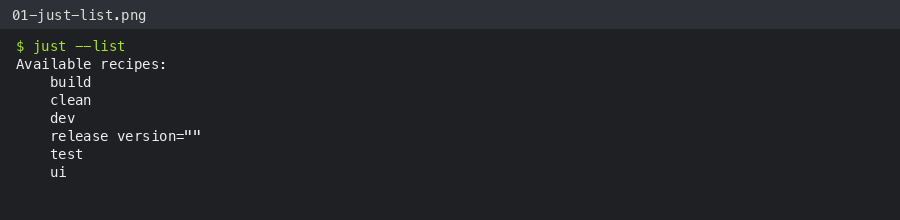
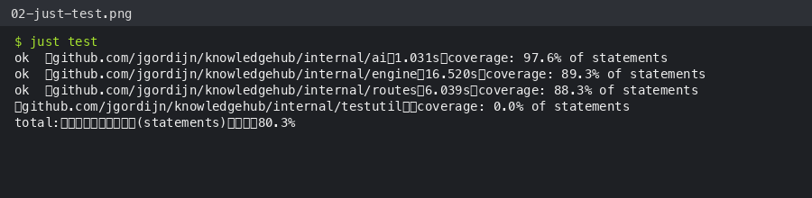
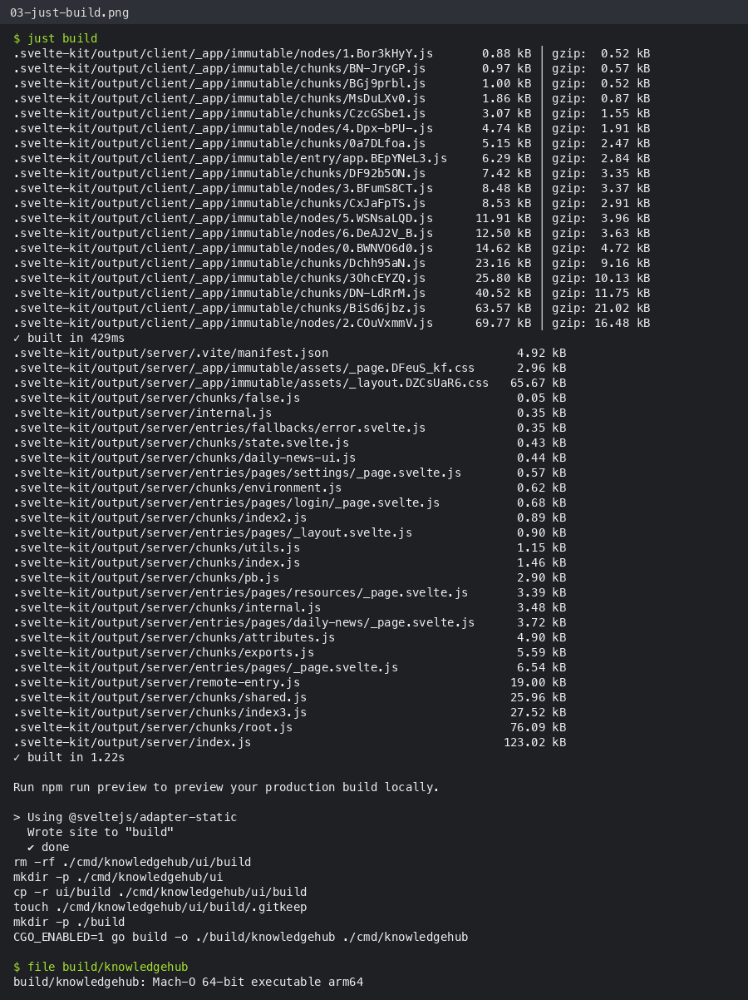
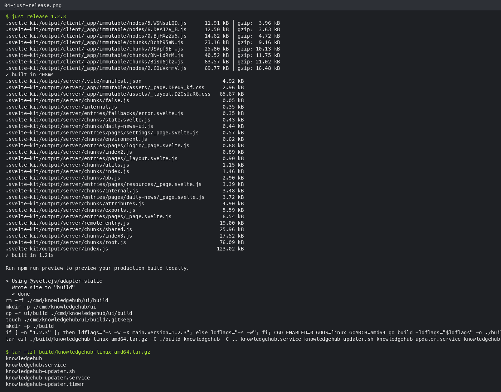
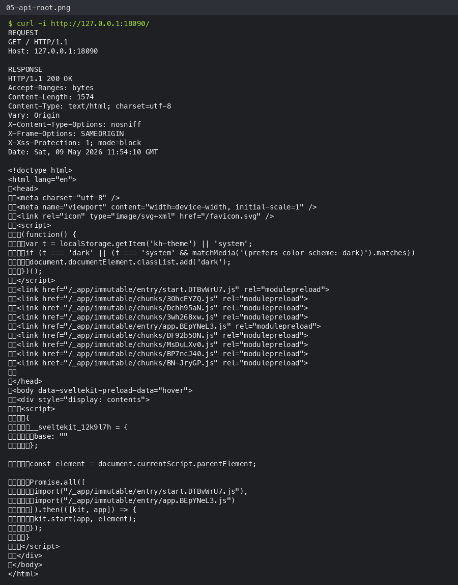

# CAD-xxxx — Replace Make with Just Proof

## Summary

This proof shows that this worktree replaced the Makefile workflow with a root `justfile`, updated automation to use `just`, and preserved build/test/release behavior.

Relevant changed files:

- `justfile` added with `ui`, `build`, `dev`, `release`, `clean`, and `test` recipes.
- `Makefile` removed.
- `.github/workflows/ci.yml` and `.github/workflows/release.yml` install and invoke `just`.
- `README.md` and `AGENTS.md` reference `just` commands.

## UI / Operator Proof

There is no product UI change in this feature. The user-visible interface for this change is the developer/operator CLI. Screenshots below show each observable CLI step.

### 1. Recipe list exposes the replacement command surface



### 2. Test recipe runs Go tests and coverage



### 3. Build recipe builds frontend assets, embeds them, and creates the local binary



### 4. Release recipe accepts an explicit version and creates the expected tarball contents



## API Proof

The feature is build tooling, not an application API feature. To prove the `just build` artifact serves the embedded UI correctly, I started the locally built binary and recorded the HTTP request/response for `/`.

### Request

```http
GET / HTTP/1.1
Host: 127.0.0.1:18090
```

### Response excerpt

```http
HTTP/1.1 200 OK
Content-Type: text/html; charset=utf-8

<!doctype html>
<html lang="en">
  <head>
    <meta charset="utf-8" />
    <meta name="viewport" content="width=device-width, initial-scale=1" />
    ...
```

Full captured request/response screenshot:



## Verification Commands Run

```bash
just --list
just test
just build
just release 1.2.3
tar -tzf build/knowledgehub-linux-amd64.tar.gz
KH_DATA_DIR=./proof_data ./build/knowledgehub serve --http=127.0.0.1:18090
curl -i http://127.0.0.1:18090/
```

## Self-review

This proof directly demonstrates the changes in this worktree:

- The Makefile replacement is visible through `just --list`.
- The new `test`, `build`, and `release` recipes execute successfully.
- The release artifact path and contents match the expected deployment package.
- The built application serves the embedded frontend over HTTP.

Conclusion: proof is sufficient for a human or another agent to verify the functionality added by this worktree.
