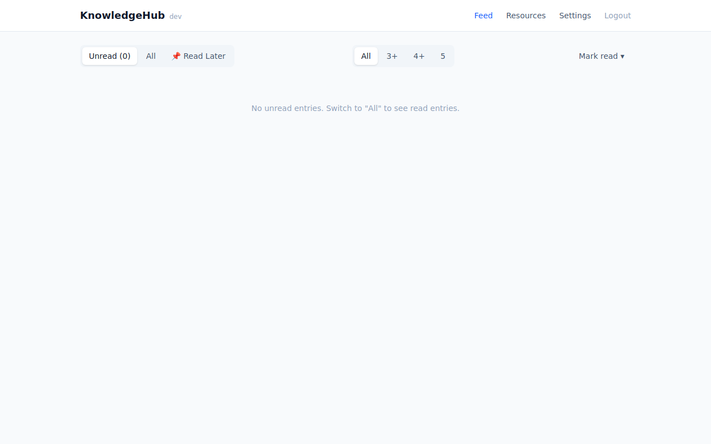
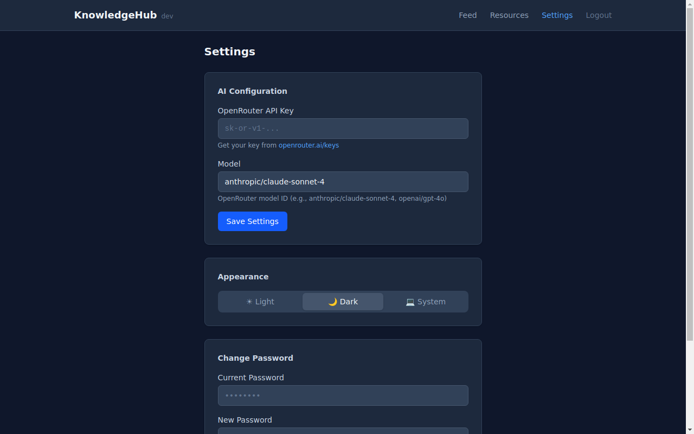
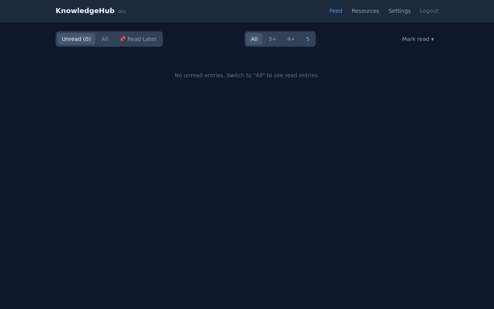

# KnowledgeHub — UI Improvements Proof

*2026-02-21T22:23:50Z by Showboat 0.6.0*
<!-- showboat-id: a14e26ed-3246-453b-ae13-ed2f81c7f3c1 -->

Three features implemented: **version display**, **dark/light/system theme toggle**, and **password change**.

## 1. Build & Tests

Frontend builds cleanly:

```bash
cd /home/jgordijn/projects/personal/knowledgehub/ui && bun run build 2>&1 | tail -3
```

```output
> Using @sveltejs/adapter-static
  Wrote site to "build"
  ✔ done
```

Go backend compiles:

```bash
cd /home/jgordijn/projects/personal/knowledgehub && go build -o /dev/null ./cmd/knowledgehub/ && echo OK
```

```output
OK
```

All tests pass:

```bash
cd /home/jgordijn/projects/personal/knowledgehub && go test ./internal/... -count=1 2>&1 | sed 's/\t[0-9.]*s$//'
```

```output
ok  	github.com/jgordijn/knowledgehub/internal/ai
ok  	github.com/jgordijn/knowledgehub/internal/engine
ok  	github.com/jgordijn/knowledgehub/internal/routes
?   	github.com/jgordijn/knowledgehub/internal/testutil	[no test files]
```

## 2. Version Endpoint

The `/api/version` endpoint returns the build version:

```bash
curl -s http://127.0.0.1:18090/api/version
```

```output
{"version":"dev"}
```

## 3. Version in Nav Bar

The version appears in light grey next to "KnowledgeHub" in the navigation:

```bash {image}

```



## 4. Dark / Light / System Theme Toggle

Settings page with Appearance section — three-way toggle. Theme persists in localStorage and a FOUC-prevention script applies the class before first paint.

**Light mode:**

```bash {image}

```


**Dark mode:**

```bash {image}

```



**Feed in dark mode:**

```bash {image}

```



### Dark mode assertion — class toggled on html element

```bash
R() { uvx rodney "$@"; }; R js "localStorage.setItem(\"kh-theme\",\"dark\")" >/dev/null && R reload >/dev/null && R waitstable >/dev/null && R assert "document.documentElement.classList.contains(\"dark\")" true -m "Dark class applied"
```

```output
pass
```

```bash
R() { uvx rodney "$@"; }; R js "localStorage.setItem(\"kh-theme\",\"light\")" >/dev/null && R reload >/dev/null && R waitstable >/dev/null && R assert "document.documentElement.classList.contains(\"dark\")" false -m "Dark class removed in light mode"
```

```output
pass
```

## 5. Change Password

The settings page includes a password change section with current password, new password, and confirmation fields. Validation: all fields required, min 8 chars, confirmation must match.
